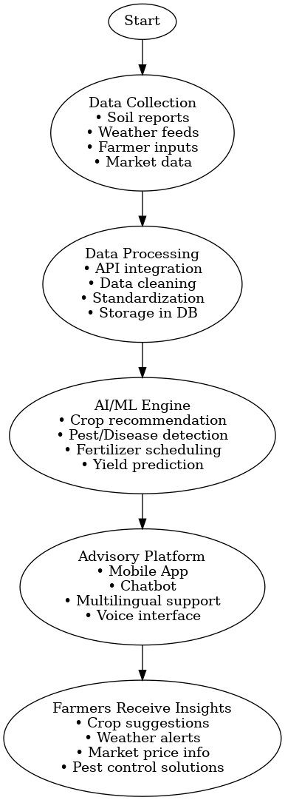

# Smart India Hackathon Workshop
# Date:
## Register Number:
## Name:
## Problem Title
SIH 25010: Smart Crop Advisory System for Small and Marginal Farmers
## Problem Description
A majority of small and marginal farmers in India rely on traditional knowledge, local shopkeepers, or guesswork for crop selection, pest control, and fertilizer use. They lack access to personalized, real-time advisory services that account for soil type, weather conditions, and crop history. This often leads to poor yield, excessive input costs, and environmental degradation due to overuse of chemicals. Language barriers, low digital literacy, and absence of localized tools further limit their access to modern agri-tech resources.

Impact / Why this problem needs to be solved

Helping small farmers make informed decisions can significantly increase productivity, reduce costs, and improve livelihoods. It also contributes to sustainable farming practices, food security, and environmental conservation. A smart advisory solution can empower farmers with scientific insights in their native language and reduce dependency on unreliable third-party advice.

Expected Outcomes

• A multilingual, AI-based mobile app or chatbot that provides real-time, location-specific crop advisory.
• Soil health recommendations and fertilizer guidance.
• Weather-based alerts and predictive insights.
• Pest/disease detection via image uploads.
• Market price tracking.
• Voice support for low-literate users.
• Feedback and usage data collection for continuous improvement.

Relevant Stakeholders / Beneficiaries

• Small and marginal farmers
• Agricultural extension officers
• Government agriculture departments
• NGOs and cooperatives
• Agri-tech startups

Supporting Data

• 86% of Indian farmers are small or marginal (NABARD Report, 2022).
• Studies show ICT-based advisories can increase crop yield by 20–30%.

## Problem Creater's Organization
Government of Punjab

## Theme
Agriculture, FoodTech & Rural Development

## Proposed Solution

<ul><li>The proposed solution is to design and develop an AI-powered mobile and web platform that delivers personalized crop advisory. Farmers will be able to receive recommendations for crop planning based on soil and weather conditions, schedules for fertilizer use and irrigation, and pest or disease identification through image recognition. The system will also provide real-time market price updates and timely notifications. The solution will be multilingual and voice-enabled to ensure accessibility for farmers with limited literacy. The uniqueness of the project lies in its ability to combine artificial intelligence, Internet of Things data, multilingual communication, and government resources in one farmer-friendly application.</li></ul>

## Technical Approach
<ul><li>The solution will use Python (Django/FastAPI) or Java (Spring Boot) for the backend and Flutter or React Native for the frontend. Data will be managed in PostgreSQL, Firebase, or MongoDB, while AI/ML models built with TensorFlow or PyTorch will provide crop recommendations and pest detection. The system will integrate weather data from OpenWeather or IMD APIs and market prices from eNAM.

The process involves collecting soil, weather, and farmer input data, standardizing it through APIs, and analyzing it with AI models. The results are delivered via a multilingual, voice-enabled mobile app and chatbot. A feedback loop ensures continuous improvement of the system.</li></ul>

## Feasibility and Viability
<ul><li>The solution is highly feasible since the technologies involved, such as AI, cloud platforms, and mobile applications, are already proven and widely adopted. The main challenges include internet connectivity issues in rural areas and the digital literacy of farmers. These challenges can be overcome by designing the application to work offline, simplifying the user interface, and adding voice-based guidance. Collaborations with NGOs and government agencies can also improve farmer adoption.</li></ul>

## Impact and Benefits
<ul><li>The solution has a wide range of benefits. Socially, it empowers farmers with localized and scientific knowledge. Economically, it helps farmers achieve better yields, reduces input costs, and improves income through better market access. Environmentally, it promotes sustainable farming practices and reduces excessive usage of fertilizers and pesticides, thereby protecting soil and water resources.</li></ul>

## Research and References
<ul><li>The work is supported by the NABARD Report of 2022, which highlights the challenges of small and marginal farmers. It also references Food and Agriculture Organization (FAO) studies on ICT in agriculture and various research papers on artificial intelligence in crop advisory and pest detection. Government initiatives such as eNAM and digital agri-tech platforms also serve as supporting references.</li></ul>
